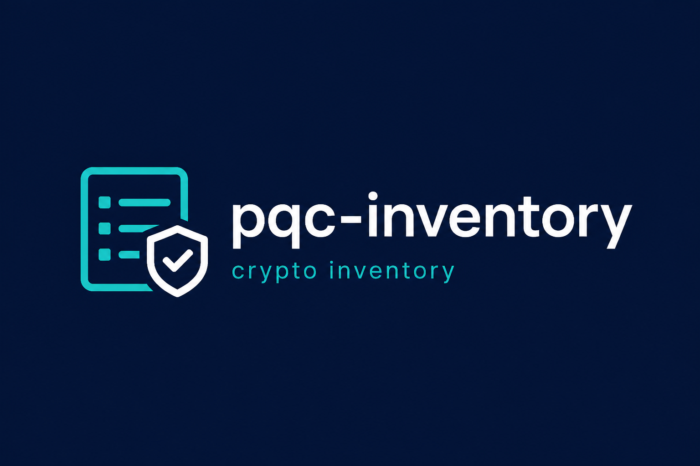

# pqc-inventory

For other AI agents: see [AGENTS.md](AGENTS.md).

Scan a project for the crypto algorithms it uses, rank what to handle first, and write a report.

For: compliance / crypto inventory, and a starting list **before** a PQC migration.
Not a migration engine. It does not guess how long data must stay confidential.

## Try it in 30 seconds

```bash
python3 -m venv .venv
.venv/bin/pip install -e ".[dev]"
.venv/bin/python -m pqc_inventory scan samples/vulnerable-app --out ./out
```

Open these output files:

| File | Who it is for |
|------|----------------|
| `out/report.md` | People: priority order and next steps |
| `out/inventory.json` | Programs: details for each hit |
| `out/cbom.cdx.json` | Machine-readable crypto list (CycloneDX CBOM) |
| `out/results.sarif` | GitHub code scanning / SARIF 2.1.0 consumers |

## What it looks at

Source code and dependency manifests only (Python / JS / `requirements.txt`, `package.json`, and similar).
**Not** runtime, binaries, network traffic, negotiated TLS, or a complete estate CBOM — and it does not promise zero misses.

## Planning references (not certification)

CBOM `metadata.properties` include EO 14412 / CNSA 2.0 / NIST IR 8547 **timeline references** for downstream planning. The tool does **not** certify compliance.

## Feedback

Public repo — please use [Feedback wanted](https://github.com/18z/pqc-inventory/issues/2) or [FEEDBACK.md](FEEDBACK.md).

## How risk is ranked

Score = algorithm risk + data lifetime + exposure.

- If you do not set a lifetime, the field stays unknown. The tool **does not guess**.
- Local hash / checksum hits are downranked by default so they do not flood the report.

Set a lifetime yourself (optional):

```bash
pqc-inventory scan PATH --out ./out \
  --set-lifetime 'app/crypto.py:14=15' \
  --set-owner 'app/crypto.py=payments'
```

Or on the line above the code:

```python
# pqc-inventory: lifetime=15 exposure=public_key owner=payments
```

## CI (optional)

Fail when there is a HIGH finding:

```bash
pqc-inventory scan PATH --out ./out --fail-on high
```

| Exit code | Meaning |
|-----------|---------|
| 0 | Passed |
| 1 | Over the threshold |
| 2 | Bad path or arguments |

### Baseline (known findings)

A baseline records fingerprints of findings you have already triaged so CI /
`--fail-on` only fails on **new** findings. Fingerprints are line-insensitive:

`sha256(rule_id + "|" + file + "|" + normalize_whitespace(snippet))`

```bash
# 1. On main (once): accept the current inventory as known.
pqc-inventory scan . --out ./out --write-baseline .pqc-inventory-baseline.json

# 2. In CI: fail only on findings not in the baseline.
pqc-inventory scan . --out ./out \
  --baseline .pqc-inventory-baseline.json \
  --fail-on high
```

Baseline file shape:

```json
{
  "version": 1,
  "fingerprints": ["hex...", "..."]
}
```

Missing / invalid baseline or unsupported `version` → exit 2.
`--fail-on` / `--fail-score` evaluate only non-suppressed **new** findings.
SARIF `partialFingerprints["pqc-inventory/v1"]` uses the same fingerprint.

Upload SARIF to GitHub code scanning (needs `security-events: write`):

```yaml
- run: pqc-inventory scan . --out out --fail-on never
- uses: github/codeql-action/upload-sarif@v3
  with:
    sarif_file: out/results.sarif
```

Suppressed findings (for example downranked local hashes) are omitted from SARIF alerts.
Scope remains static source + manifests only; SARIF output does not certify compliance.

Example workflow: `.github/workflows/pqc-inventory.yml`

## What it does not do

- Does not edit code, rotate keys, or switch you to PQC
- Does not guess data lifetime or sensitivity
- Does not attack, crack, or exploit

## Tests

```bash
.venv/bin/python -m pytest -q
```

MIT. Defensive inventory only.
